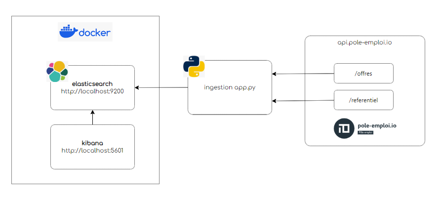

# Ingestion des offres d’emploi pole-emploi.io via l’API offres d’emploi

## Objectif

* Collecte de la totalité des offres pole-emploi.io[^1] via l’API offres d’emploi

## Présentation du jeu de données

* Il s’agit de données ouvertes, publié sous [Licence ouverte Etalab](https://pole-emploi.io/data/documentation/licence-etalab)
* Le nombre d’offres d’emploi mises à disposition est d’environ 750 000
* Il s’agit de données mises à jour en temps réel, le nombre d’offres varie constamment, notamment en journée
* Les données d’offres d’emploi pole-emploi.io sont structurées, avec des schémas de données mis à disposition
* Mise à part l’intitulé et la description, la plupart des attributs sont normés et font référence à des codes de nomenclatures officielles, accessibles également via l’API
* Ce qui permettra le croisement des données d’offres d‘emploi avec d’autres jeux de données, comme les limites géographiques des territoires (permettant une représentation spatiale des données), les populations communales, etc…

## Contraintes

* les offres sont retournées par paquet de 150 maximum; une gestion du fenêtrage des appels doit être mis en place. On indique une plage d’indices d’offres dans chaque requête via un paramètre range

* range=[INDICE_DEBUT]-[INDICE_FIN]
* Ex: **range=0-149**

    * INDICE_FIN - INDICE_DEBUT + 1 <= 150
    * INDICE_DEBUT <= 3000
    * INDICE_FIN <= 3149

* Les appels aux API doivent être authentifiés avec la méthode Bearer token. Ce token est obtenu préalablement via une requête d’authentification en fournissant le couple d’identifiants associé à l’application déclaré sur pole-emploi.io
* Ce token a une durée de vie limitée à 1499 s (env. 25 min). Avant chaque appel, il faut donc s’assurer qu’il n’est pas expiré et requêter un nouveau token le cas échéant

* Les valeurs max de INDICE_DEBUT et INDICE_FIN limitent le nombre maximum de résultats qu’il est permit de retourner pour une recherche donnée à **MAX_OFFRES_RETURN=3149**
* Par ailleurs, le nombre d’appels est limité à 3 par seconde. En cas de dépassement de cette limite, la réponse HTTP 429 Too Many Requests est retournée, avec un header _Retry-After_ indiquant le nombre de secondes de temporisation (NB: toujours égal à 1)
* Il est donc nécessaire, pour ingérer l’ensemble des offres, d’itérer sur des critères de recherche qui retournent moins de 3149 offres
* Un header Content-Range retourné dans la réponse HTTP de chaque requête, fournit la plage effectivement retournée et le nombre total d’offres pour la requête
* Ce header est de la forme: **offres [INDICE_DEBUT]-[INDICE_FIN]/[NB_TOTAL_OFFRES]**
* La valeur NB_TOTAL_OFFRES permet de contrôler que le nombre d’offres retournées est inférieur à NB_MAX_REQUETE, et d’itérer sur une granularité plus fine le cas échéant

