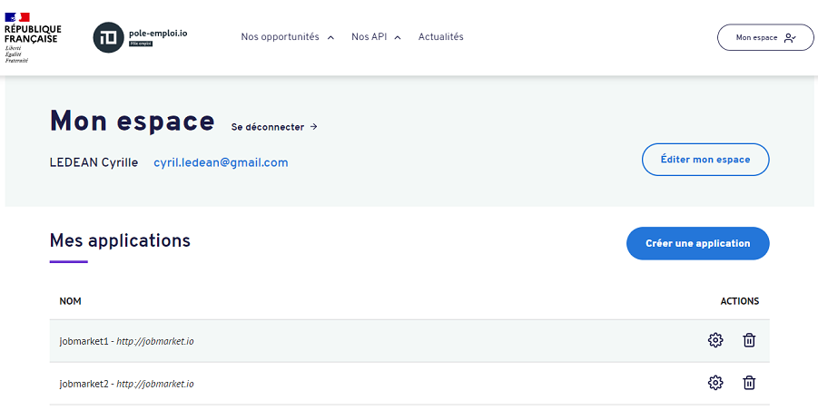
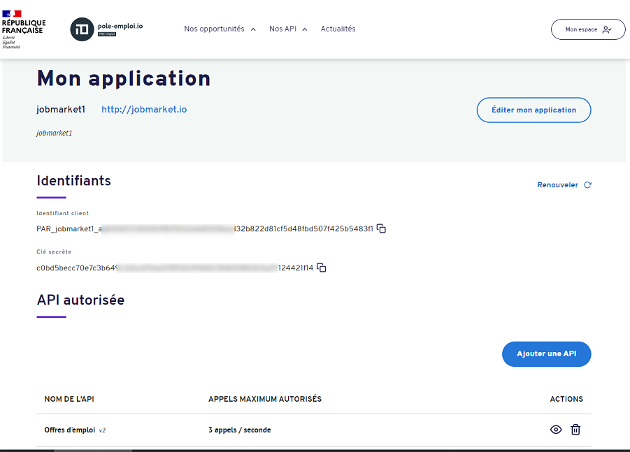
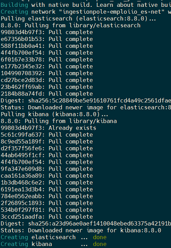
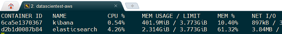
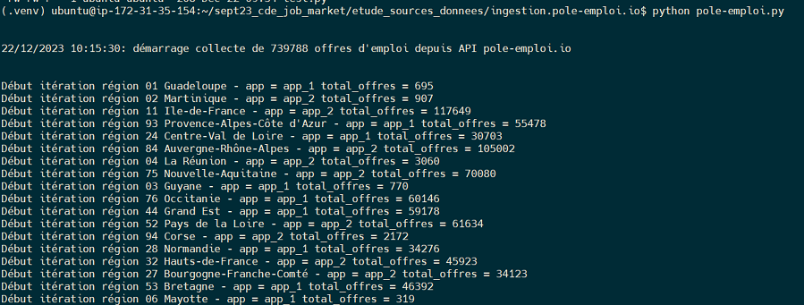
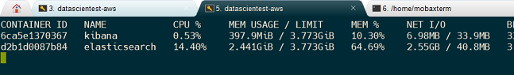

# Ingestion des offres d’emploi pole-emploi.io via l’API offres d’emploi

## Objectif

* Collecte de la totalité des offres [pole-emploi.io](https://pole-emploi.io) via l’API _offres d’emploi_.

## Présentation du jeu de données

* Il s’agit de données ouvertes, publié sous [Licence ouverte Etalab](https://pole-emploi.io/data/documentation/licence-etalab)

* Le nombre d’offres d’emploi mises à disposition est d’environ 750 000

* Il s’agit de données mises à jour en temps réel, le nombre d’offres varie constamment, notamment en journée

* Les données d’offres d’emploi pole-emploi.io sont structurées, avec des schémas de données mis à disposition

* Mise à part l’intitulé et la description, la plupart des attributs sont normés et font référence à des codes de nomenclatures officielles, accessibles également via l’API

* Ce qui permettra le croisement des données d’offres d‘emploi avec d’autres jeux de données, comme les limites géographiques des territoires (permettant une représentation spatiale des données), les populations communales, etc…

## Contraintes

* les offres sont retournées par paquet de 150 maximum; une gestion du fenêtrage des appels doit être mis en place. On indique une plage d’indices d’offres dans chaque requête via un paramètre range

* range=[INDICE_DEBUT]-[INDICE_FIN]
* Ex: **range=0-149**

    * INDICE_FIN - INDICE_DEBUT + 1 <= 150
    * INDICE_DEBUT <= 3000
    * INDICE_FIN <= 3149

* Les appels aux API doivent être authentifiés avec la méthode Bearer token. Ce token est obtenu préalablement via une requête d’authentification en fournissant le couple d’identifiants associé à l’application déclaré sur pole-emploi.io

* Ce token a une durée de vie limitée à 1499 s (env. 25 min). Avant chaque appel, il faut donc s’assurer qu’il n’est pas expiré et requêter un nouveau token le cas échéant

* Les valeurs max de INDICE_DEBUT et INDICE_FIN limitent le nombre maximum de résultats qu’il est permit de retourner pour une recherche donnée à **MAX_OFFRES_RETURN=3149**

* Par ailleurs, le nombre d’appels est limité à 3 par seconde. En cas de dépassement de cette limite, la réponse HTTP 429 Too Many Requests est retournée, avec un header _Retry-After_ indiquant le nombre de secondes de temporisation (NB: toujours égal à 1)

* Il est donc nécessaire, pour ingérer l’ensemble des offres, d’itérer sur des critères de recherche qui retournent moins de 3149 offres

* Un header Content-Range retourné dans la réponse HTTP de chaque requête, fournit la plage effectivement retournée et le nombre total d’offres pour la requête

* Ce header est de la forme: **offres [INDICE_DEBUT]-[INDICE_FIN]/[NB_TOTAL_OFFRES]**

* La valeur NB_TOTAL_OFFRES permet de contrôler que le nombre d’offres retournées est inférieur à NB_MAX_REQUETE, et d’itérer sur une granularité plus fine le cas échéant

## Stack technique mise en place pour les tests d’ingestion

* L’ingestion est effectué via le script Python pole-emploi.py

* **Elasticsearch** est utilisé comme _datalake_ pour l’ingestion. Les données étant retournées au format JSON, il est donc facile de pousser les données via l’API REST d’Elasticsearch

* Pour la suite du projet, on pourra étudier la création d’un datawarehouse sur un système de base de données relationnelle, alimenté depuis le datalake Elasticsearch après la phase d’ingestion

* Les capacités de recherche textuelle d’Elasticsearch pourront être utilisé pour la recherche de mots clés présents notamment dans les attributs intitulé et description des offres

* Elasticsearch génère par défaut un identifiant **_id** pour chaque document indexé, ou bien utilise la valeur de _id qui lui est fournie. Chaque offre étant identifiée par un attribut id d’offre unique, celui-ci sera utilisé comme _id d’indexation Elasticsearch. Cela garantit que chaque offre ne sera indexée qu’une fois

* Les tests sont réalisés depuis ma machine de développement, ElasticSearch et Kibana sont déployé facilement via Docker et un fichier **docker-compose.yml**

* Pour l’ingestion, 3 indexes sont créés:

  * **ingestion**: métadonnées de chaque exécution du traitement (date/heure début et fin, durée, nombre total d’offres disponibles / ingérées)
  * **erreurs**: pour monitoring et pouvoir rejouer les requêtes en échec
  * **offres**: offres d’emploi

* l’interface Dev Tools de Kibana est utilisé pour monitorer le traitement d’ingestion pendant son exécution (Menu Management > Dev Tools)


## Principe général de requêtage des offres

* On requête sur un 1er niveau de granularité de recherche (ex: région)

* Si le nombre d’offres retournées est supérieur au nombre maximum d’offres qu’il est possible de récupérer pour une recherche donnée, on itère sur un niveau de granularité de recherche plus précis

* Sinon on requête l’ensemble des plages de résultats par paquets de 150 offres max

* Le schéma de données des offres n’indique pas le caractère requis ou non des différents attributs; de fait, tous les attributs ne sont pas systématiquement renseignés. Il faut donc requêter l’API sur des attributs systématiquement valorisés, sans quoi les offres dont l’attribut utilisé pour la recherche n’est pas renseigné ne seront pas retournées

* Par ailleurs, on ne peut récupérer que 3149 offres pour une requête; il faut donc itérer sur des critères de recherche permettant de maximiser le nombre total d’offres collectées par rapport au total des offres disponibles, sans trop rallonger le temps total d'exécution du traitement d’ingestion

* Quelques tests ont permis de déterminer que les **critères sur la localisation et le code métier ROME** donnent les meilleurs résultats

* La limitation de 3 appels/s n'est pas appliquée au niveau de l'adresse IP mais par instance d'application; afin d'accélérer le traitement de collecte, deux instances d'application sont utilisées

* Les référentiels régions, départements, communes et métiers ROME sont collectées depuis l'API. Ils permettent d'itérer sur les codes et de les utiliser comme valeurs de paramètres des requêtes

* Parcours des offres:

  * Pour chaque région, requêtage de l’ensemble des offres si NB_TOTAL_OFFRES < = NB_MAX_REQUETE, sinon requêtage de chaque département de la région
  * Pour chaque département de la région, requêtage de l’ensemble des offres si NB_TOTAL_OFFRES < = NB_MAX_REQUETE, sinon requêtage de chaque code métier ROME du département
  * Le traitements de chaque région est exécuté dans un thread distinct
  * Les threads de traitement d'une région sont répartis entre les deux instances d'application, ce qui permet de diviser par 2 le temps total de collecte.

## Mise en place

* **pole-emploi.io**

  * Création d'un compte utilisateur
  * Création de deux instances d'application (cf. Test ingestion). Pour chacune des deux instances, un couple d'identifiant est généré
  * Ajout de l'API Offres d'emploi pour les deux instances d'application


**pole-emploi.io: Mon espace**



**pole-emploi.io: application jobmarket1 avec API Offres d'emploi**




* Déploiement (manuel) de la solution sur une machine Linux apr clonage du projet

NB: par la suite on envisagera un déploiement via CI/CD

```
#Clonage du projet depuis dépôt GitHub
$ git clone git@github.com:cyrilleledean/sept23_cde_job_market.git

#Positionnement dans le dossier du traitement de collecte
$ cd sept23_cde_job_market/etude_sources_donnees/ingestion.pole-emploi.io

#Création environnement virtuel + dépendances
$ python3 -m venv .venv
$ source .venv/bin/activate
$ python -m pip install --upgrade pip
$ pip install -r requirements.txt
```

* Créer un fichier secrets.json, en renseignant les couples client_id/client_secret des deux applications déclarées sur pole-emploi.io

**secrets.json**
```
{
    "client_id_job_market_1": "[client_id_1]",
    "client_secret_job_market_1": "[client_secret_1]",
    "client_id_job_market_2": "[client_id_2]",
    "client_secret_job_market_2": "[cclient_secret_2]"
}
```

* Lancer Elasticsearch et Kibana (Kibana facultatif, commenter le service dans docker-compose.yml le cas échéant)

```
$ docker-compose up -d
```



* Vérification de la bonne éxecution des conteneurs avec affichage des ressources consommées

```
$ docker stats
```



* Execution du traitement

```
$ python pole-emploi.py
```



* Monitoring de l'état d'avancement

Pour suivre l'état d'avancement on peut executer la requête suivante sur l'API REST d'Elasticsearch, sur l'index offres

```
$ curl --location --request GET 'http://localhost:9200/offres/_count'
```

```
{"count":602024,"_shards":{"total":1,"successful":1,"skipped":0,"failed":0}}
```

## Exemple de résultats:

```
$ curl --location --request GET 'http://localhost:9200/ingestion/_search'
```
**index ingestion**
```
{
    "took": 6,
    "timed_out": false,
    "_shards": {
        "total": 1,
        "successful": 1,
        "skipped": 0,
        "failed": 0
    },
    "hits": {
        "total": {
            "value": 1,
            "relation": "eq"
        },
        "max_score": 1.0,
        "hits": [
            {
                "_index": "ingestion",
                "_id": "C5EokYwBUcNpRU9GbT7e",
                "_score": 1.0,
                "_source": {
                    "message": "Fin ingestion des offres d'emploi depuis API pole-emploi.io",
                    "date_debut": "22/12/2023 10:15:30",
                    "date_fin": "22/12/2023 10:53:15",
                    "total_offres": 739788,
                    "total_offres_collecte": 726945,
                    "duree_totale": "00:37"
                }
            }
        ]
    }
}
```

* Nombres d’offres disponibles au lancement du traitement: **739 788**
* Nombres d’offres ingérées: **726945** soit **98.3 %** des offres
* Temps total d’ingestion des 739 788 offres: **37 min** (très satisfaisant !)
* Espace disque occupé par les offres: **1.7G**

```
docker exec -it elasticsearch bash
$ cd /usr/share/elasticsearch/data
$ du -hs indices/

# 1.7G indices/
```

* Monitoring des ressources consommées par Elasticsearch

**Avant lancement du traitement de collecte**


**Durant l'execution du traitement de collecte**



NB: la commande docker stats indique qu'Elasticsearch consomme entre 2 et 3G de mémoire juste pour s'executer, mais pas beaucoup plus durant l'ingestion. En revanche le CPU est un peu plus sollicité


**NB: ne pas oublier d'arrêter Elasticsearch pour ne pas consommer de la ressource inutilement !**

```
$ docker-compose stop

#Stopping kibana        ... done
#Stopping elasticsearch ... done
```

